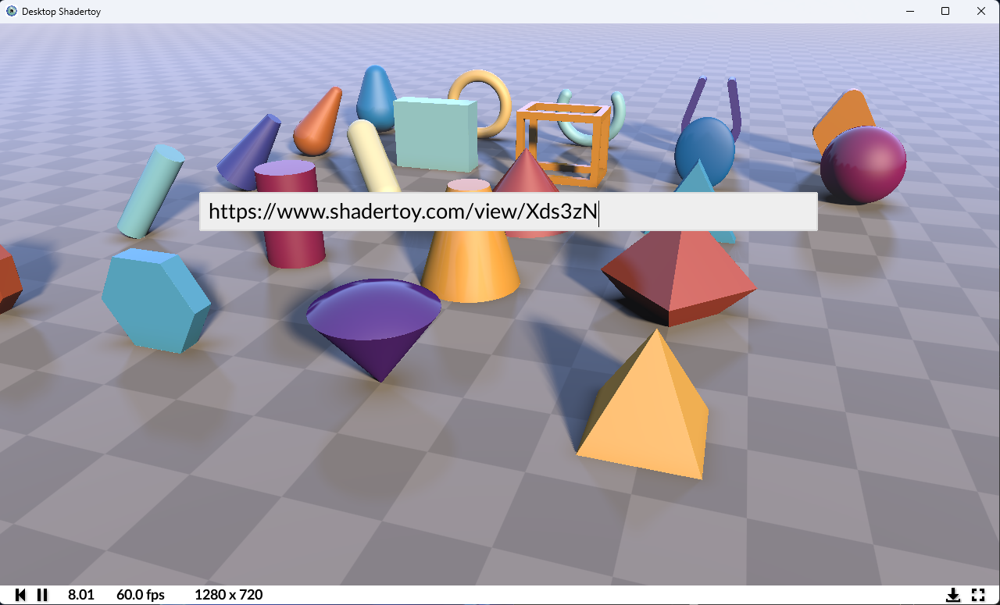
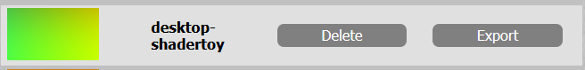
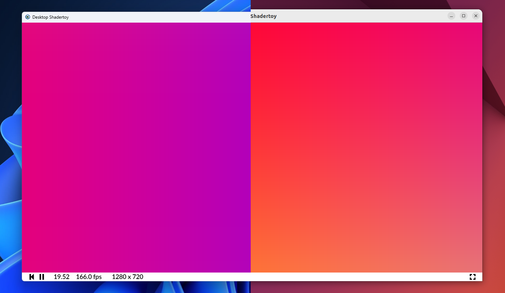

# Desktop Shadertoy

  

## Why?
Desktop Shadertoy is a desktop client application for Shadertoy projects, allowing enthusiasts to open Shadertoys in profilers and graphics debuggers like Renderdoc or NVIDIA NSight.

## Features
Desktop Shadertoy is absolutely a work in progress but it already supports multi-pass shaders such as [this](https://www.shadertoy.com/view/msG3zG) or [this](https://www.shadertoy.com/view/stVfWc).

New in version 0.4, you can modify the shader code and select inputs from the desktop UI!

New in version 0.3.0, you can fetch the contents of shaders that use the "Public + API" setting through the download bar that comes up if you press the download button next to the fullscreen button. You can do so by providing either the URL or just the ID, which in this example is [Xds3zN](https://www.shadertoy.com/view/Xds3zN)

Alternatively, you can create or fork a shadertoy. Then go to your profile, where you'll be able to export it as a json file. Drag and drop this json onto the app window, and it will compile the shadertoy for you!

You can use normal buffers, the common buffer, Cubemap buffers, and the image buffer. All built-in variables like iMouse and iTime are supported, and inputs can have the expected configuration parameters like mip-mapping, filtering modes and wrap modes.

The releases tentatively ship with the assets from the Shadertoy website itself, so projects that utilize the images and/or cubemaps from the site will work on desktop as well.

## Issues
If you find any issues with Desktop Shadertoy, I'd love it if you opened an issue on GitHub. It should be noted that with the download feature, many "Public" shaders might not support the Public + API setting, and you'll notice that it results in an in-app error message of "Shader not found". A great issue to report is if a shadertoy that you run results in 1) a shader compilation error, or 2) an application crash. Be sure to include in the issue what shadertoy or json file caused the issue.

Some shadertoys use GLSL that is not compliant with Vulkan GLSL, and so Desktop Shadertoy does preprocessing on the shadercode to fix-up as many incompatibilities as possible. That being said, some issues still remain such as uninitialized local variables.

## Future Plans
I currently don't have plans on supporting Audio passes, however this would be a welcome and interesting PR if anyone was super passionate about it.

## Platforms
Desktop Shadertoy is supported on Windows and Linux

  

